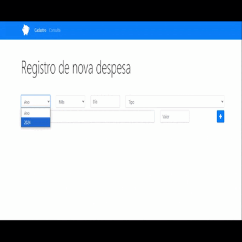
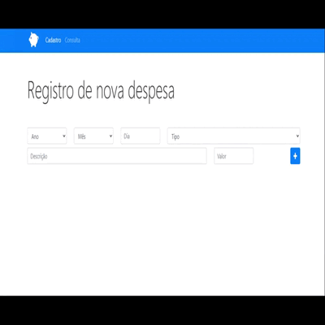
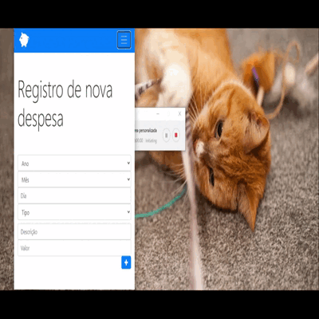

# Controle de Despesas

Este projeto é uma aplicação simples para você controlar suas despesas pessoais. Dá pra registrar, consultar, filtrar e até excluir gastos. Tudo isso direto no seu navegador, já que os dados ficam armazenados no `localStorage`.

## O que dá pra fazer

- **Cadastrar despesas**: Adicione seus gastos, informando data, tipo, descrição e valor.
- **Consultar despesas**: Veja todos os gastos que já cadastrou e aplique filtros pra facilitar a busca.
- **Excluir despesas**: Remove gastos que não quiser mais ver na lista.
- **Filtrar despesas**: Use filtros pra encontrar despesas específicas por data, tipo, descrição e valor.

## Aplicação
<table align="center">
	<tr>
		<th> </th>
		<th> </th>
      <th> </th>
	</tr>
</table>

## Tecnologias usadas

- **HTML5**: Estrutura do site.
- **CSS3**: Estilos de layout.
- **JavaScript (ES6)**: Lógica de negócio e manipulação do `localStorage`.
- **Bootstrap 4**: Framework CSS para layout responsivo.
- **Font Awesome**: Ícones utilizados na interface.
- **jQuery**: Utilizado para facilitar a manipulação do DOM.

## Como usar

### Cadastro de Despesas

1. Na página **Cadastro** (`index.html`), preencha os campos:
   - **Ano**: Selecione o ano do gasto.
   - **Mês**: Escolha o mês.
   - **Dia**: Insira o dia.
   - **Tipo**: Escolha o tipo da despesa (ex.: Alimentação, Educação, etc.).
   - **Descrição**: Descreva o gasto.
   - **Valor**: Insira o valor.

2. Depois, é só clicar no botão com o **+** pra registrar. Um aviso vai aparecer pra confirmar.

### Consulta de Despesas

1. Na página **Consulta** (`consulta.html`), você vai ver todas as despesas cadastradas.

2. Pode filtrar seus gastos pelos seguintes critérios:
   - **Ano**: Escolha o ano que quer ver.
   - **Mês**: Filtre pelo mês.
   - **Dia**: Filtre pelo dia.
   - **Tipo**: Filtre pelo tipo de despesa.
   - **Descrição**: Procure por termos específicos.
   - **Valor**: Filtre por valor.

3. Clicou na **lupa**? Pronto, sua pesquisa está feita!

4. Quer excluir algo? Clique no **X** vermelho ao lado da despesa que quer remover.

## Como contribuir

Se quiser colaborar com o projeto, é simples:

1. Faça um **fork** do repositório.
2. Crie uma nova branch:
   ```bash
   git checkout -b minha-nova-feature
   ```
3. Faça mudanças e **commite**:
   ```bash
   git commit -m 'Adicionei tal funcionalidade'
   ```
4. Envie as mudanças:
   ```bash
   git push origin minha-nova-feature
   ```
5. Abra um Pull Request e pronto!
